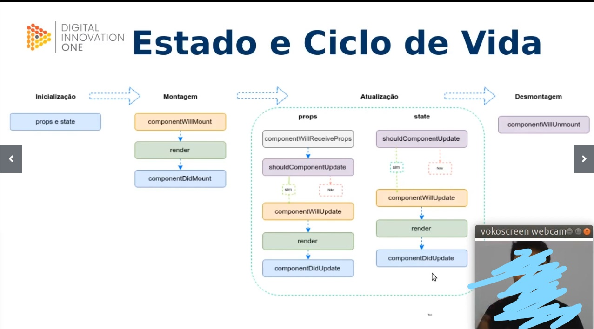

# Introdução ao React

## O que é React?

"Uma biblioteca JavaScript para criar interfaces de usuário" - Reactjs

Função: criação da interface para o usuário.

* React é uma biblioteca e não um framework
* React é uma linguagem declarativa
* Pode ser usado em qualquer lugar
* É baseado em componentes

O React está preocupado apenas com o que é exibido na interface do usuário.


## O que é JSX?

Não é nem uma HTML e nem uma string!

```shell
	const element = <h1>Hello, world!</h1>
```

O React não separa as tecnologias colocando marcação em arquivos separados, e sim separa conceitos e mantém o código pouco acoplado chamando-os de componentes.

* Não é obrigatório a utilização de JSX.

Sintax Suggar para React.createElement

O browser não interpreta o JSX, para isso é necessário um transpilador para que a aplicação possa entender o código. O mais utilizado é o Babel.


## Componentes no React
São pequenas peças dentro de um único projeto.
* Pode ser uma função ou uma classe.


## Estado e Ciclo de Vida do React

Ele possui quatro estados:

1. Inicialização
2. Montagem
3. Atualização
4. Desmontagem

<p align="center">
  
</p>

Nenhum componente pai ou filho devem saber se outrocomponente possui estado ou não.
O estado é apenas local ao componente e caso seja necessário enviar algum atributo para outro então é feito via props.


## Ecossistema

1. React Router
2. Redux
3. Material UI
4. Ant-Design
5. Storybook
6. Gatsby
7. Jest
8. React i18n Next

etc...


## O que é Webpack?

É um module bundler (um empacotador de módulos para aplicações JS), gera um bundler que será utilizado no HTML, em ES5.
bundler: arquivo final onde todos os módulos são empacotados dentro de um único arquivo

Suporte:
* Fontes
* CSS
* Imagens
* HTML
* JS
* Plugins

### Conceitos

* Entry:
Utilizando grafo, o Webpack precisa de um ponto de entrada para buscar todos os módulos e dependências.

* Output:
É para determinar quais são os bundlers que o Webpack irá emitir

* Loaders:
É para permitir que o Webpack gerencie arquivos que não são Javascript

* Plugins:
Plugins podem ser utilizados para otimização de pacotes, mimificação, injeção de scripts e muito mais

* Mode:
Utilizados para abordagem de configuração zero. É possível configurar módulos como production, development ou none.

* Production:
Trás otimizações internas

* Development:
É executado com três plugins: UglifyjsPlugin, ModuleConcatenationPlugin e NoEmitOnErrorsPlugin


## Configuração

### Criação do arquivo webpack.config.js

```shell
	npm i -D webpack webpack-cli

	"build": "webpack --mode production"

	npm i @babel/core babel-loader @babel/present-env @babel/present-react --save-dev
```

### Criação do arquivo .babelrc

```shell
	{
	  "presets": [
	    "@babel/preset-env"
	  ]
	}
```

### Instalando react-dom e babel-preset

```shell
	npm i react react-dom
	npm i -D babel-preset-react

	{
	  "presets": [
	    "@babel/preset-env",
	    "@babel/preset-react" 
	  ]
	}
```

### Criação do aplicativo

```shell
	src/index.js
	src/App.jsx

	import React from "react";
	import ReactDom from "react-dom";
	import App from "./App";
	ReactDom.render(<App />, document.getElementById("app"));
```

### Adicionando um Dev Server

```shell
	npm i -D webpack-dev-server

	"scripts":{
	 "start:dev": "webpack-dev-server"
	}
```

### Configuração do EsLint

```shell
	npm install --save-dev eslint babel-eslint eslint-plugin-react eslint-watch
```

## Renderização Condicional
Em React, você pode criar componentes distintos que encapsulam o comportamento que você precisa. Então, você pode renderizar apenas alguns dos elementos, dependendo do estado da sua aplicação.


## Manipulando Eventos
Manipular eventos em elmentos React é muito semelhante a manipular eventos em elementos do DOM. Existem algumas diferenças sintáticas:

* Eventos em React são nomeados usando camelCase ao invés de letras minúsculas.
* Com o JSX você passa uma função como manipulador de eventos ao invés de um texto.


# Pensando do Jeito React

* Comece com um Mock
* Separe a UI em uma hierarquia de componentes
* Crie uma versão estática em React
* Identifique a Representação mínima (mas completa) do State da UI
* Identifique onde o state deve ficar
* Adicione o fluxo de dados inverso


