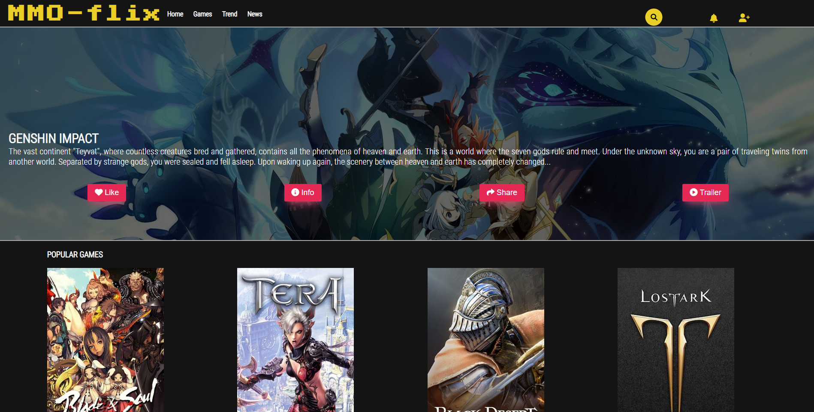

# Projeto baseado no site Netflix

  

Este projeto foi realizado com base no site "Netflix", desafio então proposto pelo bootcamp Impulso. Busqyei usar de minha criatividade e trazer um assunto da qual gosto muito que são os jogos RPG. E portando, o projeto funciona como uma plataforma para ver notícias e videos de jogos então lançados e que estão para ser lançados.

Me utilizei de ferramentas HTML, CSS, JQuery para sua construção. Focando assim na proposta do desafio em focar no Front End.

## Header

  

No header, tentei usar uma fonte diferente assim como as fontes do restante do site, importadas do google-fontes, Usei de hover nos ícones da nav, assim como search bar. O último ícone seria o formulário para incrição no site. No formulário consta as caixas de email, senha e login funcionando, assim como o link para uma nova inscrição.
