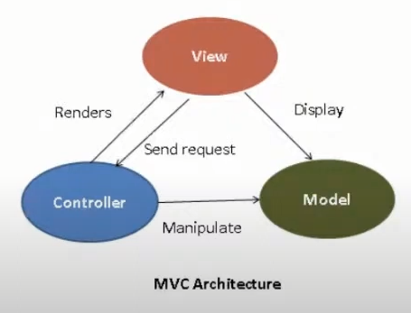
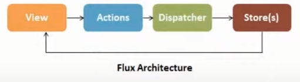
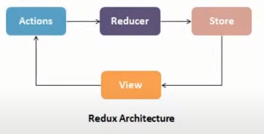

# React e Redux

## Conceitos

1. React: A JavaScript library for building user interfaces.

* Declarativo
* Baseado em componentes
* Aprenda uma vez, escreva em qualquer lugar

2. Redux: A predictable state container for JS apps

* State containers são um bloco (container) da sua aplicação que armazena um estado de forma centralizada, que pode ser lido por outros blocos da aplicação.
* Previsível
* Centralizado
* Debugável
* Flexível

## Influências 

1. Linguagem elm

* Imutabilidade
* Api declarativa
* Operações determinísticas
* Controlar side-effects (quando não se pode evitá-los)

2. Arquitetura flux

* Como era a arquitetura MVC
<p align="center">
  
 </p>
 
 * Arquitetura flux
 <p align="center">
  
 </p>
 
 * Arquitetura redux
 <p align="center">
  
 </p>

## Os três princípios

1. Uma única fonte de verdade
2. Estado disponível apenas para leitura
3. Mudanças no estado são feitas apenas por funções puras

## Aspectos (API)

```shell
1. store: createStore()

const store = createStore(counterReducer);


2. reducer: store.getState()

function counterReducer(state = { value: 0 }, action) {
	switch (action.type) {
		case 'counter/incremented':
			return { value: state.value + 1 }
		case 'counter/decremented':
			return { value: state.value - 1 }
		default:
			return state
	}
}


3. action: store.dispatch()

store.dispatch({ type: 'counter/incremented' }) // {value: 1}
store.dispatch({ type: 'counter/incremented' }) // {value: 2}
store.dispatch({ type: 'counter/decremented' }) // {value: 1}


4. view: connect(react-redux)

function TodoList() {
	return (
		// ...renders something
	)
}

--
function mapStateToProps(state) {
	return { todoList: state.todos.allIds };
}

export default connect(mapStateToProps)(TodoList);

--
function TodoList({ todoList }) {
	return (
		// ...renders something
	)
}

--
function TodoList({ todoList, dispatch }) {
	return (
		// ...renders something and dispatch an action
	)
}

--
function mapDispatchToProps (dispatch) {
	return {
		toogleTodo: (id) => dispatch({ type: 'todos/toggle', payload: id }),
	}
}

export default connect(mapStateToProps, mapDispatchToProps)(TodoList)

--
function TodoList({ todoList, toggleTodo }) {
	return (
		// ...renders todos and toogleTodo
	)
}

5. Selectors

function selectTodoList(state) {
	return state.todos.allIds;
}

--
function mapStateToProps(state) {
	return {
		todoList: selectTodoList(state)
	}
}
```

## Middlewares
It provides a third-party extension point between dispatching an action, and the momento it reaches the reducer.

```shell
type MiddlewareAPI = (dispatch: Dispatch, getState: () => State }
type Middleware = (api: MiddlewareAPI) => (next: Dispatch) => Dispatch

--
exemplo

function logger({ getState }) {
	return next => action => {
		console.log('will dispatch', action)
		
		const returnValue = next(action)

		console.log('state after dispatch', getState())

		return returnValue
	}
}

--
criar a store

const store = creatStore(reducer, {}, applyMiddleware(logger))

--
criar stores através de heranças

type StoreEnhancer = (next: StoreCreator) => StoreCreator
```

## Começando um projeto

```shell
$ npx creat-react-app my-app --template redux
```

* 1.4.1 @reduxjs/toolkit
```shell
Instalação
---
# NPM

$ npm install @reduxjs/toolkit

# YARN

$ yarn add @reduxjs/tollkit

---
* configureStore (redux-think + Redux DevTools Extension)

import { configureStore } from '@reduxjs/toolkit'

import rootReducer from './reducers'

const store = configureStore({ reducer: rootReducer })


* createReducer (immer.js)

import { createAction, createReducer } from '@reduxjs/toolkit'

interface CounterState {
	value: number
}

const increment = creatAction('counter/increment')
const decrement = creatAction('counter/decrement')
const incrementByAmount = creatAction<number>('counter/incrementByAmount')

const initialState = { value: 0 } as CounterState

const counterReducer = createreducer(initialState, (builder) => {
	builder
		.addCase(increment, (state, action) => {
			state.value++
		})
		.addCase(decrement, (state, action) => {
			state.value--
		})
		.addCase(incrementByAmount, (state, action) => {
			state.value += action.payload
		})
})


* createAction

import { creatAction } from '@reduxjs/toolkit'

const increment = creatAction<number | undefined>('counter/increment')

let action = increment()
// { type: 'counter/increment' }

action = increment(3)
// returns { type: 'counter/increment', payload: 3 }

console.log(increment.toString())
// 'counter/increment'

console.log(`The action type is: ${increment}`)
// 'the action type is: counter/increment'


* createSlice (reducers + actions)

import { creatSlice, PayloadAction } from '@reduxjs/toolkit'

interface CounterState {
	value: number
}

const initialState = { value: 0 } as CounterState

const counterSlice = createSlice({
	name: 'counter',
	initialState,
	reducers: {
		increment(state) {
			state.value++
		},
		decrement(state) {
			state.value--
		},
		incrementByAmount(state, action: PayloadAction<number>) {
			state.value += action.payload
		},
	},
})

export const { increment, decrement, incrementByAmount } = counterSlice.actions
export default counterSlice.reducer


* createSelector (reselect)
```

## Alternativas de state containers

* Context API (React)
* Recoil (FB)
* Mobx (redux-saga, RxJS)
* XState

## Prós e contras de state containers

Prós
* simplifica problemas de data-flow complexos
* pontos unicos de controle de estado

Contras
* complica problemas de data-flow simples

# Conclusão
* Super poderoso, mas pode ser custoso
* Super extensível, mas precisa de clareza
* State containers resolvem problemas não triviais
* Flexível para resolver vários problemas, mas talvez não o seu
* Propósito do redux é muito diferente do react, e pode ser usado em outras soluções.


# Developer Experience

## Redux Devtools
* window.__REDUX_DEVTOOLS_EXTENSION__ (google chrome)
* redux-detools-extension (store.js)

```shell
# NPM

$ npm install --save redux-devtools-extension

# YARN

$ yarn add redux-devtools-extension

------
chamando a lib

import { createStore, applyMiddleware } from 'redux';
import { composeWithDevTools } from 'redux-devtools-extension';

const store = createStore(reducer, composeWithDevTools(
	applyMiddleware(...middleware),
	// other store enhancers if any
));
```
* @reduxjs/tollkit já traz ele implementado e habilitado por padrão

## Melhores práticas

* Redux Style Guide

Princípios essenciais
1. Do not Mutate State 
2. Reducers Must Not Have Side Effects 
3. Do Not Put Non-Serializable Values in State or Actions 
4. Only One Redux Store Per App 

## Ducks pattern
To me, it makes more sense for these pieces to be bundled together in an isolated module that is self contained, and can even be packaged easily into a library.

* Must export default a function called reducer()
* Must export its action creators as functions
* Must have action types in the form npm-module-or-app/reducer/ACTION_TYPE
* May export its action types as UPPER_SNAKE_CASE, if an external reducer needs to listen for them, or if it is a published reusable library

```shell
exemplo

const LOAD = 'my-app/widgets/LOAD';
const CREATE = 'my-app/widgets/CREATE';
const UPDATE = 'my-app/widgets/UPDATE';
const REMOVE = 'my-app/widgets/REMOVE';

export default function reducer(state = {}, action = {}) {
	switch (action.type) {
		// do reducer stuff
		default: return state;
	}
}

export function loadWidgets() {
	return { type: LOAD };
}

export function createWidget(widget) {
	return { type: CREATE, widget };
}

export function updateWidget(widget) {
	return { type: UPDATE, widget };
}

export function removeWidget(widget) {
	return { type: REMOVE, widget };
}

export function getWidget () {
	return dispatch => get('/widget').then(widget => dispatch(updateWidget(widget)))
}
```
## Higher-Order-Reducers

```shell
const withPagination = (section, reducer) => (state, action) => {
	switch(action.type) {
		case `${section}_GO_NEXT_PAGE`: {
			return { ...state, page: state.page + 1 }
		}

		// other actions ...

		default: {
			return reducer(state, action);
		}
	}
};

export default createStore
	combineReducers({
		users: withPagination('USERS', users),
		articles: withPagination('ARTICLES', articles),
		login,
	})
);
```
